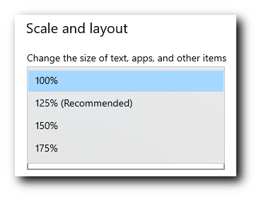

[![Latest Release][pypi-version-badge]][pypi-version-url]
[![Python version][pypi-python-version-badge]][pypi-version-url]

# Manim Slides

Tool for live presentations using either [Manim (community edition)](https://www.manim.community/) or [ManimGL](https://3b1b.github.io/manim/). Manim Slides will *automatically* detect the one you are using!

> **_NOTE:_**  This project extends the work of [`manim-presentation`](https://github.com/galatolofederico/manim-presentation), with a lot more features!

- [Installation](#installation)
  * [Dependencies](#dependencies)
  * [Pip install](#pip-install)
  * [Install From Repository](#install-from-repository)
- [Usage](#usage)
  * [Basic Example](#basic-example)
  * [Key Bindings](#key-bindings)
  * [Interactive Tutorial](#interactive-tutorial)
  * [Other Examples](#other-examples)
- [Comparison with Similar Tools](#comparison-with-similar-tools)
- [F.A.Q](#faq)
  * [How to increase quality on Windows](#how-to-increase-quality-on-windows)
- [Contributing](#contributing)

## Installation

<!-- start install -->

While installing Manim Slides and its dependencies on your global Python is fine, I recommend using a virtual environment (e.g., [venv](https://docs.python.org/3/tutorial/venv.html)) for a local installation.

### Dependencies

<!-- start deps -->

Manim Slides requires either Manim or ManimGL to be installed. Having both packages installed is fine too.

If none of those packages are installed, please refer to their specific installation guidelines:
- [Manim](https://docs.manim.community/en/stable/installation.html)
- [ManimGL](https://3b1b.github.io/manim/getting_started/installation.html)

<!-- end deps -->

### Pip Install

The recommended way to install the latest release is to use pip:

```bash
pip install manim-slides
```

### Install From Repository

An alternative way to install Manim Slides is to clone the git repository, and install from there: read the [contributing guide](https://eertmans.be/manim-slides/contributing/workflow.html) to know how.

<!-- end install -->

## Usage

<!-- start usage -->

Using Manim Slides is a two-step process:
1. Render animations using `Slide` (resp. `ThreeDSlide`) as a base class instead of `Scene` (resp. `ThreeDScene`), and add calls to `self.pause()` everytime you want to create a new slide.
2. Run `manim-slides` on rendered animations and display them like a *Power Point* presentation.

The documentation is available [online](https://eertmans.be/manim-slides/).

### Basic Example

Wrap a series of animations between `self.start_loop()` and `self.stop_loop()` when you want to loop them (until input to continue):

```python
# example.py

from manim import *
# or: from manimlib import *
from manim_slides import Slide

class BasicExample(Slide):
    def construct(self):
        circle = Circle(radius=3, color=BLUE)
        dot = Dot()

        self.play(GrowFromCenter(circle))
        self.pause()  # Waits user to press continue to go to the next slide

        self.start_loop()  # Start loop
        self.play(MoveAlongPath(dot, circle), run_time=2, rate_func=linear)
        self.end_loop()  # This will loop until user inputs a key

        self.play(dot.animate.move_to(ORIGIN))
        self.pause()  # Waits user to press continue to go to the next slide
```

First, render the animation files:

```bash
manim example.py BasicExample
# or
manimgl example.py BasicExample
```

To start the presentation using `Scene1`, `Scene2` and so on simply run:

```bash
manim-slides [OPTIONS] Scene1 Scene2...
```

Or in this example:

```bash
manim-slides BasicExample
```

<!-- end usage -->

##  Key Bindings

The default key bindings to control the presentation are:


You can run the **configuration wizard** to change those key bindings:

```bash
manim-slides wizard
```

A default file can be created with:

```bash
manim-slides init
```

> **_NOTE:_**  `manim-slides` uses key codes, which are platform dependent. Using the configuration wizard is therefore highly recommended.

## Interactive Tutorial

Click on the image to watch a slides presentation that explains you how to use Manim Slides.

[](https://eertmans.be/manim-slides/)

## Other Examples

Other examples are available in the [`example.py`](https://github.com/jeertmans/manim-slides/blob/main/example.py) file, if you downloaded the git repository.

Below is a small recording of me playing with the slides back and forth.


## Comparison with Similar Tools

There exists are variety of tools that allows to create slides presentations containing Manim animations.

Below is a comparison of the most used ones with Manim Slides:

| Project name | Manim Slides | Manim Presentation | Manim Editor | Jupyter Notebooks |
|:------------:|:------------:|:------------------:|:------------:|:-----------------:|
| Link | [](https://github.com/jeertmans/manim-slides) | [](https://github.com/galatolofederico/manim-presentation) | [](https://github.com/ManimCommunity/manim_editor) | [](https://github.com/jupyter/notebook) |
| Activity | [](https://github.com/jeertmans/manim-slides) | [](https://github.com/galatolofederico/manim-presentation) | [](https://github.com/ManimCommunity/manim_editor) | [](https://github.com/jupyter/notebook) |
| Usage | Command-line | Command-line | Web Browser | Notebook |
| Note | Requires minimal modif. in scenes files | Requires minimal modif. in scenes files |  Requires the usage of sections, and configuration through graphical interface | Relies on `nbconvert` to create slides from a Notebook |
| Support for ManimGL | Yes | No | No | No |
| Web Browser presentations | Yes | No | Yes | No |
| Offline presentations | Yes, with Qt | Yes, with OpenCV | No | No

## F.A.Q

### How to increase quality on Windows

On Windows platform, one may encounter a lower image resolution than expected. Usually, this is observed because Windows rescales every application to fit the screen.
As found by [@arashash](https://github.com/arashash), in [#20](https://github.com/jeertmans/manim-slides/issues/20), the problem can be addressed by changing the scaling factor to 100%:



in *Settings*->*Display*.

## Contributing

Contributions are more than welcome! Please read through [our contributing section](https://eertmans.be/manim-slides/contributing/index.html).

[pypi-version-badge]: https://img.shields.io/pypi/v/manim-slides?label=manim-slides
[pypi-version-url]: https://pypi.org/project/manim-slides/
[pypi-python-version-badge]: https://img.shields.io/pypi/pyversions/manim-slides
