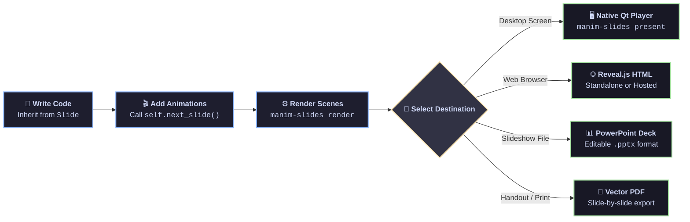

<p align="center">
  <picture>
    <source media="(prefers-color-scheme: dark)" srcset="https://raw.githubusercontent.com/jeertmans/manim-slides/main/static/logo_dark_transparent.png">
    <source media="(prefers-color-scheme: light)" srcset="https://raw.githubusercontent.com/jeertmans/manim-slides/main/static/logo_light_transparent.png">
    
  </picture>
</p>

<!-- start pypi -->

<div align="center">

[![Latest Release][pypi-version-badge]][pypi-version-url]
[![Python version][pypi-python-version-badge]][pypi-version-url]
[![PyPI - Downloads][pypi-download-badge]][pypi-version-url]
[![Documentation][documentation-badge]][documentation-url]
[![DOI][doi-badge]][doi-url]
[![JOSE Paper][jose-badge]][jose-url]
[![codecov][codecov-badge]][codecov-url]
[![Binder][binder-badge]][binder-url]

# 🎬 Manim Slides

**Transform mathematical animations into sleek, interactive presentations.**

Works automatically with both **[Manim Community Edition](https://www.manim.community/)** and **[3Blue1Brown's ManimGL](https://3b1b.github.io/manim/)**!

[📖 Documentation](https://eertmans.be/manim-slides/) •
[🚀 Quick Start](#-usage) •
[✨ Key Features](#-key-features) •
[📊 Comparison](#-comparison-with-similar-tools) •
[🤝 Contributing](#-contributing)

</div>

---

> [!NOTE]
> This project extends the pioneering work of [`manim-presentation`](https://github.com/galatolofederico/manim-presentation) with a rich set of modern presentation features, offline exporting, and web synchronization!

---

## ✨ Key Features

<div align="center">

| Feature | Description |
| :--- | :--- |
| ⚡ **Dual Engine Auto-Detection** | Seamlessly works with both `manim` (Community) and `manimgl` without configuration. |
| 🎮 **Live Interactive Presenter** | Fluid playback, slide-reversal, pause-on-demand, and looping animations. |
| 📦 **Multi-Format Export** | Export directly to **Reveal.js HTML**, **PowerPoint PPTX**, **PDF**, or **HTML Zip**. |
| 📡 **Real-Time Web Sync** | Synchronize slide state and live laser pointers with audience via Firebase. |
| ⌨️ **Intuitive Keybindings** | Instant shortcuts to replay slides (`R`), toggle controls (`C`), and show help (`?`). |
| 🎨 **Theme Flexibility** | Full support for dark and light modes (`white`, `black`, `solarized`, etc.). |

</div>

---

## 🗺️ Visual Presentation Workflow


```mermaid
graph LR
    classDef step fill:#1e1e2e,stroke:#89b4fa,stroke-width:2px,color:#cdd6f4;
    classDef branch fill:#313244,stroke:#f9e2af,stroke-width:2px,color:#cdd6f4;
    classDef target fill:#181825,stroke:#a6e3a1,stroke-width:2px,color:#cdd6f4;

    A["📝 <b>Write Code</b><br>Inherit from <code>Slide</code>"]:::step --> B["🎬 <b>Add Animations</b><br>Call <code>self.next_slide()</code>"]:::step
    B --> C["⚙️ <b>Render Scenes</b><br><code>manim-slides render</code>"]:::step
    C --> D{"🎯 <b>Select Destination</b>"}:::branch

    D -->|"Desktop Screen"| E["🖥️ <b>Native Qt Player</b><br><code>manim-slides present</code>"]:::target
    D -->|"Web Browser"| F["🌐 <b>Reveal.js HTML</b><br>Standalone or Hosted"]:::target
    D -->|"Slideshow File"| G["📊 <b>PowerPoint Deck</b><br>Editable <code>.pptx</code> format"]:::target
    D -->|"Handout / Print"| H["📄 <b>Vector PDF</b><br>Slide-by-slide export"]:::target
```

---

## 💻 Installation

Manim Slides requires either **Manim** or **ManimGL** to be installed, along with their respective system dependencies (such as FFmpeg).

```bash
# Install with PyPI
pip install manim-slides

# Or install with uv (recommended for ultra-fast setup)
uv pip install manim-slides
```

For platform-specific instructions (macOS, Linux, Windows), check out the [Installation Guide](https://eertmans.be/manim-slides/latest/installation.html).

---

## 🚀 Usage

<!-- start usage -->

Using Manim Slides is a simple two-step process:

1. **Write & Render**: Inherit from `Slide` (or `ThreeDSlide`) instead of `Scene`, and insert `self.next_slide()` wherever you want a pause.
2. **Present & Share**: Run `manim-slides` to present animations like a native PowerPoint or export them to modern web decks.

### 📝 Basic Example

```python
from manim import *  # or: from manimlib import *

from manim_slides import Slide


class BasicExample(Slide):
    def construct(self):
        circle = Circle(radius=3, color=BLUE)
        dot = Dot()

        self.play(GrowFromCenter(circle))
        self.next_slide()  # Pauses presentation until you press NEXT

        self.next_slide(loop=True)  # Begins looping animation
        self.play(MoveAlongPath(dot, circle), run_time=2, rate_func=linear)
        self.next_slide()  # Exits loop and moves to the next slide

        self.play(dot.animate.move_to(ORIGIN))
```

Render your slide scene using `manim-slides render`:

```bash
# Render with Manim Community
manim-slides render example.py BasicExample

# Or render with ManimGL
manim-slides render --GL example.py BasicExample
```

<!-- end usage -->

> [!NOTE]
> `manim-slides render` automatically detects the Manim installation in your active virtual environment. It acts as an optimized wrapper around `manim render` and `manimgl`.

---

### 🖥️ Presenting Slides

<!-- start more-usage -->

To launch the live presentation player:

```bash
manim-slides BasicExample
```

Or present multiple scenes in sequence:

```bash
manim-slides Scene1 Scene2 Scene3
```

<!-- end more-usage -->

<p align="center">
  
</p>

---

## ⌨️ Interactive Controls & Shortcuts

<details>
<summary><b>🔍 Click to view Presentation Keyboard Shortcuts</b></summary>

<br>

| Key | Action | Context | Description |
| :--- | :--- | :--- | :--- |
| <kbd>Space</kbd> | **Play / Pause** | All Players | Toggles video animation playback. |
| <kbd>→</kbd> / <kbd>PageDown</kbd> | **Next Slide** | All Players | Advances to the next slide. |
| <kbd>←</kbd> / <kbd>PageUp</kbd> | **Previous Slide** | All Players | Navigates back to the preceding slide. |
| <kbd>R</kbd> | **Replay Slide** | Reveal.js & Qt | Rewinds and replays current slide animation. |
| <kbd>C</kbd> | **Toggle Controls** | Reveal.js HTML | Shows/hides video seekbar scrubber. |
| <kbd>F</kbd> | **Full Screen** | All Players | Toggles fullscreen presentation mode. |
| <kbd>?</kbd> | **Help Overlay** | Reveal.js HTML | Displays complete keyboard shortcuts modal. |
| <kbd>Q</kbd> | **Quit** | Native Player | Closes the presentation window. |

</details>

---

## 🌐 Exporting to Other Formats

Convert your animations for the web, documents, or conference slideshows:

```bash
# Export to Reveal.js HTML (Light Theme)
manim-slides convert BasicExample presentation.html -c reveal_theme=white

# Export all assets self-contained in a single HTML file
manim-slides convert BasicExample presentation.html --one-file

# Export to PowerPoint (.pptx)
manim-slides convert BasicExample presentation.pptx

# Export to Printable PDF
manim-slides convert BasicExample presentation.pdf
```

---

## 🎥 Interactive Tutorial

Click on the thumbnail below to launch an interactive presentation explaining how to use Manim Slides:

<p align="center">
  <a href="https://eertmans.be/manim-slides/">
    
  </a>
</p>

---

## 📊 Comparison with Similar Tools

Below is a side-by-side comparison of tools used to present mathematical Manim animations:

| Feature / Project | 🎬 **Manim Slides** | 📽️ **Manim Presentation** | 💻 **Manim Editor** | 📓 **Jupyter Notebooks** |
| :--- | :---: | :---: | :---: | :---: |
| **GitHub Stars** | [![GitHub Stars][stars-slides]][repo-slides] | [![GitHub Stars][stars-presentation]][repo-presentation] | [![GitHub Stars][stars-editor]][repo-editor] | [![GitHub Stars][stars-jupyter]][repo-jupyter] |
| **Last Activity** | [![Last Commit][commit-slides]][repo-slides] | [![Last Commit][commit-presentation]][repo-presentation] | [![Last Commit][commit-editor]][repo-editor] | [![Last Commit][commit-jupyter]][repo-jupyter] |
| **Primary Interface** | Command-Line & GUI | Command-Line | Web Browser GUI | Notebook Cells |
| **Scene Modifications** | Minimal (`Slide`) | Minimal (`Presentation`) | Sections Required | `nbconvert` Setup |
| **ManimGL Support** | ✅ **Yes** | ❌ No | ❌ No | ❌ No |
| **HTML Export** | ✅ **Reveal.js + Cloud** | ❌ No | ✅ Yes | ❌ No |
| **PowerPoint Export** | ✅ **Yes (`.pptx`)** | ❌ No | ❌ No | ❌ No |
| **PDF Export** | ✅ **Yes (`.pdf`)** | ❌ No | ❌ No | ❌ No |
| **Offline Presentations** | ✅ **Qt, RevealJS, PPTX** | ✅ OpenCV | ❌ No | ❌ No |

---

## 📚 Citing Manim Slides

If you use Manim Slides in academic research, lectures, or conference talks, please cite:

```bibtex
@article{Jerome_Eertmans_Manim_Slides_A_2023,
    title   = {{Manim Slides: A Python package for presenting Manim content anywhere}},
    author  = {{Jérome Eertmans}},
    year    = 2023,
    month   = aug,
    journal = {Journal of Open Source Education},
    volume  = 6,
    doi     = {10.21105/jose.00206}
}
```

---

## 🤝 Contributing

We warmly welcome contributions of all kinds! Please read through our [Contributing Guidelines](https://eertmans.be/manim-slides/latest/contributing/index.html) to get started.

### 🐛 Reporting an Issue

<!-- start reporting-an-issue -->

If you think you found a bug, an error in the documentation, or wish there was a feature currently missing, we would love to hear from you!

The best way to reach us is via [GitHub Issues](https://github.com/jeertmans/manim-slides/issues). If your problem is not covered by an existing issue, please [create a new issue](https://github.com/jeertmans/manim-slides/issues/new/choose).

<!-- end reporting-an-issue -->

### 💬 Seeking for Help

<!-- start seeking-for-help -->

Have a question about using Manim Slides? First check the [F.A.Q](https://eertmans.be/manim-slides/latest/faq.html) to see if it has been answered. If not, feel free to open a discussion in GitHub Issues.

<!-- end seeking-for-help -->

### 📬 Contact

<!-- start contact -->

If you do not have a GitHub account or wish to contact the author directly, reach out at [jeertmans@icloud.com](mailto:jeertmans@icloud.com).

<!-- end contact -->

---

<div align="center">
  <sub>Built with ❤️ for mathematical presentations and educator communities. Distributed under the MIT License.</sub>
</div>

<!-- Badges & Links Reference Definitions -->
[pypi-version-badge]: https://img.shields.io/pypi/v/manim-slides?label=manim-slides&color=blue
[pypi-version-url]: https://pypi.org/project/manim-slides/
[pypi-python-version-badge]: https://img.shields.io/pypi/pyversions/manim-slides
[pypi-download-badge]: https://img.shields.io/pypi/dm/manim-slides?color=green
[documentation-badge]: https://readthedocs.org/projects/manim-slides/badge/?version=latest
[documentation-url]: https://manim-slides.readthedocs.io/
[doi-badge]: https://zenodo.org/badge/DOI/10.5281/zenodo.7971360.svg
[doi-url]: https://doi.org/10.5281/zenodo.7971360
[jose-badge]: https://jose.theoj.org/papers/10.21105/jose.00206/status.svg
[jose-url]: https://doi.org/10.21105/jose.00206
[codecov-badge]: https://codecov.io/gh/jeertmans/manim-slides/branch/main/graph/badge.svg?token=8P4DY9JCE4
[codecov-url]: https://codecov.io/gh/jeertmans/manim-slides
[binder-badge]: https://mybinder.org/badge_logo.svg
[binder-url]: https://mybinder.org/v2/gh/jeertmans/manim-slides-binder/HEAD?filepath=getting_started.ipynb

[repo-slides]: https://github.com/jeertmans/manim-slides
[stars-slides]: https://img.shields.io/github/stars/jeertmans/manim-slides?style=social
[commit-slides]: https://img.shields.io/github/last-commit/jeertmans/manim-slides?style=social

[repo-presentation]: https://github.com/galatolofederico/manim-presentation
[stars-presentation]: https://img.shields.io/github/stars/galatolofederico/manim-presentation?style=social
[commit-presentation]: https://img.shields.io/github/last-commit/galatolofederico/manim-presentation?style=social

[repo-editor]: https://github.com/ManimCommunity/manim_editor
[stars-editor]: https://img.shields.io/github/stars/ManimCommunity/manim_editor?style=social
[commit-editor]: https://img.shields.io/github/last-commit/ManimCommunity/manim_editor?style=social

[repo-jupyter]: https://github.com/jupyter/notebook
[stars-jupyter]: https://img.shields.io/github/stars/jupyter/notebook?style=social
[commit-jupyter]: https://img.shields.io/github/last-commit/jupyter/notebook?style=social
