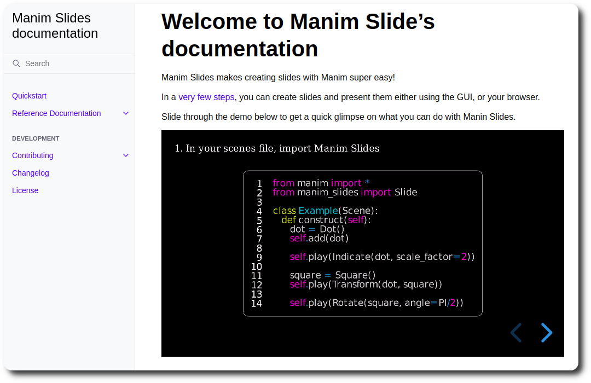

# Summary

Manim Slides is a Python package that makes presenting Manim animations
straightforward. With minimal changes required to pre-existing code, one can
slide through animations in a *PowerPoint-like* manner, or share its slides
*online* using ReavealJS' power.

# Introduction

Presenting educational content has always been a difficult task, especially
when it uses temporal or iterative concepts. During the last decades, the
presence of computers in classrooms for educational purposes has increased
enormously, allowing teachers to show animated or interactive content.

With the democratization of YouTube, many people have decided to use this
platform to share educational content. Among these people, Grant Sanderson, a
YouTuber presenting videos on the theme of mathematics, quickly became known
for his original and quality animations. In 2018, Grant announced in a video
that he creates his animations using a self-developed Python tool called Manim
[@manim-announcement]. In 2019, he made the Manim source code public [@manimgl],
so anyone can use his tool. Very quickly, the community came together and, in
2020, created a "fork" of the original GitHub repository [@manimce], in order to
create a more accessible and better documented version of this tool. Since then,
the two versions are differentiated by using ManimGL for Grant Sanderson's
version, as it uses OpenGL for rendering, and ManimCE for the community edition
(CE).

Despite the many advantages of the Manim tool in terms of illustrating
mathematical concepts, one cannot help but notice that most presentations,
whether in the classroom or at a conference, are mainly done with PowerPoint
or PDF slides. One of the many advantages of these formats, as opposed to videos
created with Manim, is the ability to pause, rewind, etc., whenever you want.

To face this problem, in 2021, the manim-presentation tool was created
[@manim-presentation]. This tool allows you to present Manim animations as you
would present slides: with pauses, slide jumps, etc. However, this tool has
evolved very little since its inception and does not work with ManimGL.

In 2022, Manim Slides has been created from manim-presentation, with the aim
to make it a more complete tool, better documented, and usable on all platforms
and with ManimCE or ManimGL. After almost a year of existence, Manim Slides has
evolved a lot (see
[comparison section](#comparison-with-manim-presentation)),
has built a small community of contributors, and continues to
provide new features on a regular basis.

# Easy to Use Commitment

Manim Slides is committed to be an easy-to-use tool, with minimal installation
procedure and few modifications required. It can either be used locally with its
graphical user interface (GUI), or shared via one of the two formats it can
convert to:

* an HTML page thanks to the RevealJS Javascript package [@revealjs];
* or a PowerPoint (`.pptx`) file.

This work has a very similar syntax to Manim and offers a comprehensive
documentation hosted on [GitHub pages](https://jeertmans.github.io/manim-slides/), see
\autoref{fig:docs}.

# Example usage

We have used manim-presentation for our presentation at the COST
Interact, hosted in Lyon, 2022, and
[available online](https://web.archive.org/web/20230507184944/https://eertmans.be/posts/cost-interact-presentation/).
This experience highly motivated the development of Manim Slides, and our
EuCAP 2023 presentation slides are already
[available online](https://web.archive.org/web/20230507211243/https://eertmans.be/posts/eucap-presentation/), thanks
to Manim Slides' HTML feature.

Also, one of our users created a short
[video tutorial](https://www.youtube.com/watch?v=Oc9g89VzKsY&ab_channel=TheoremofBeethoven)
and posted it on YouTube.

# Stability and releases

Manim Slides is continuously tested on most recent Python versions, both ManimCE
and ManimGL, and on all major platforms: **Ubuntu**, **macOS** and **Windows**. Due to Manim
Slide's exposed API being very minimal, and the variety of tests that are
performed, this tool can be considered stable over time.

New releases are very frequent, as they mostly introduce enhancements or small
documentation fixes, and the command-line tool automatically notifies for new
available updates. Therefore, regularly updating Manim Slides is highly
recommended.

# Statement of Need

Similar tools to Manim Slides also exist, such as its predecessor,
manim-presentation [@manim-presentation], or the web-based alternative, Manim
Editor [@manim-editor], but none of them provide the documentation level nor the
amount of features that Manim Slides strives to. This work makes the task of
presenting Manim content in front of an audience much easier than before,
allowing presenters to focus more on the content of their slides, rather than on
how to actually present them efficiently.

## Target Audience

Manim Slides was developed with the goal of making educational content more
accessible than ever. We believe that researchers, professors, teaching
assistants and anyone else who needs to teach scientific content can benefit
from using this tool. The ability to pace your presentation yourself is
essential, and Manim Slides gives you that ability.

## A Need for Portability

One of the major concerns with presenting content in a non-standard format
(i.e., not just a plain PDF) is the issue of portability.
Depending on the programs available, the power of the target computer,
or the access to the internet, not all solutions are equal.
From the same configuration file, Manim Slides offers a series of solutions to
share your slides, which we discuss on our
[Sharing your slides](https://jeertmans.github.io/manim-slides/reference/sharing.html)
page.

## Comparison with manim-presentation

Starting from @manim-presentation's original work, Manim Slides now provides
numerous additional features.
A non-exhaustive list of those new features is as follows:

* ManimGL compatibility;
* playing slides in reverse;
* exporting slides to HTML and PowerPoint;
* 3D scene support;
* multiple key inputs can map to the same action
  (e.g., useful when using a pointer);
* optionally hiding mouse cursor when presenting;
* recording your presentation;
* multiple video scaling methods (for speed-vs-quality tradeoff);
* and automatic detection of some scene parameters
  (e.g., resolution or background color).

The complete and up-to-date set of features Manim Slide supports is
available in the
[online documentation](https://jeertmans.github.io/manim-slides/).
For new feature requests, we highly encourage users to
[create an issue](https://github.com/jeertmans/manim-slides/issues/new/choose)
with the appropriate template.

# Acknowledgments

We acknowledge the work of @manim-presentation that paved the initial structure
of Manim Slides with the manim-presentation Python package.

We also acknowledge Grant Sanderson for his tremendous work on Manim, as
well as the Manim Community contributors.

Finally, we also acknowledge contributions from the GitHub contributors on the
Manim Slides repository.

# References
